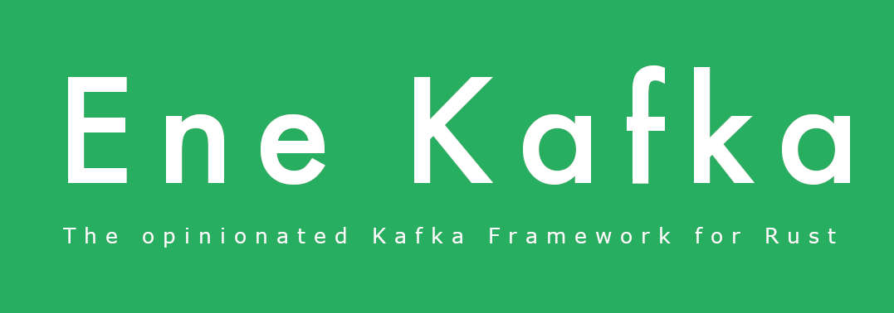

# Ene Kafka: The Opinionated Kafka Framework for Rust

<p align="center">

</p>

[![Crates.io][crates-badge]][crates-url]
[![Crates.io][derive-crates-badge]][derive-crates-url]
[![Apache licensed][license-badge]][license-url]
[![Build Status][actions-badge]][actions-url]

[crates-badge]: https://img.shields.io/crates/v/ene-kafka.svg?label=ene-kafka
[crates-url]: https://crates.io/crates/ene-kafka
[derive-crates-badge]: https://img.shields.io/crates/v/ene-kafka-derive.svg?label=ene-kafka-derive
[derive-crates-url]: https://crates.io/crates/ene-kafka-derive
[license-badge]: https://img.shields.io/badge/license-Apache%20v2-blue.svg
[license-url]: https://github.com/ene-rs/ene-kafka/blob/main/LICENSE
[actions-badge]: https://github.com/ene-rs/ene-kafka/actions/workflows/rust.yml/badge.svg
[actions-url]: https://github.com/ene-rs/ene-kafka/actions?query=branch%3Amain

Originally a small internal project built for https://enelyzer.com/ (hence the `Ene` in the name) to increase code readibility and speed of delivery, but we liked it so much we decided to make it public

## Introduction
Ene kafka is a Kafka client for Rust that is intended to facilitate the interaction with Apache Kafka in Rust programs. The main goal of Ene kafka is to make the process of building event-driven microservices That use Kafka for their distributed messaging system easier and quicker. 

Ene Kafka uses cloud events to define the structure of messages that are consumed and produced.

## Examples

Create an event:
```rust
#[derive(KafkaMessage, Serialize, CloudEvent, Debug, Deserialize, DeserializeFrom)]
#[kafka(topic = "test", serde = Json, key = entity_id, headers = CloudEvent)]
#[cloud_event(
    content_type = "application/json",
    version = "1.0",
    event_type = "com.ene.entity.created.v1",
    event_source = "https://ene-kafka.com/docs/cloudevents/entity/created"
)]
struct EntityCreated {
    pub entity_id: i64,
    pub organisation_id: i64,
}
```

Produce an event:
```rust
let producer: KafkaProducer = kafka_producer!(bootstrap_servers = bootstrap_servers.clone());
    let event = EntityCreated {
        entity_id: 1755,
        organisation_id: 42,
    };

producer.send(event).await?;
```

Consume and handle an event:
```rust
// Create a handler to process the event
#[derive(EventHandler)]
#[event_handler(event = EntityCreated, handler = handle_entity_created_event)]
struct EntityCreatedEventHandler {
     // Optionally some state for the handler
}

impl EntityCreatedEventHandler {
    async fn handle_entity_created_event(&self, event: &EntityCreated) -> ene_kafka::KafkaResult<()> {
        println!("EntityCreatedEventHandler: {:?}", event);
        // Do something with the event
        Ok(())
    }
}

// Create a consumer that listens to the topic and registers the handler
let consumer = kafka_consumer!(
    topic = KafkaTopic {
        name: "test".to_string(),
        content_type: ContentType::Json
    },
    // Dead letter queueing is included in the consumer!
    dlq_topic = KafkaTopic {
        name: "test-dlq".to_string(),
        content_type: ContentType::Json
    },
    consumer_group_id = "test-group",
    bootstrap_servers = bootstrap_servers,
    handlers = [
        EntityCreatedEventHandler -> EntityCreatedEventHandler { /*Handler state initialisation*/ }
    ]
);
```
For more examples, check the [examples](ene_kafka_examples/) folder in the repository.

## Features
- **Ease of Use thanks to Rust Macros**: Ene Kafka uses Rust macros to make it easier to define Kafka messages and to produce and consume them. The macros help abstracting away a big chunk of the boilerplate, making it possible for you to focus on what matters most: your business logic.

- **CloudEvents**: Ene Kafka supports the CloudEvents specification for event messages.

- **Dead Letter Queueing**: Ene Kafka supports dead letter queueing for messages that fail to be handled.

- **Automatic (De)serialization**: Ene Kafka automatically serializes and deserializes messages into the specified event type.

- **Extensiblity**: Ene Kafka is designed with extensibility in mind (though this is still a work in progress). It should be possible to use different underlying clients for Kafka, or to use other serialization libraries instead of serde.

- **Async by default**

## Limitations
- **Only JSON format is supported**: Ene Kafka only supports JSON serialization and deserialization at the moment. There is no support for Avro or Protobuf

- **rdKafka is the only supported Kafka client implementation**: Ene kafka is mostly a pretty interface implemented on top of an existing Kafka client for Rust. The intention is to make it possible for the developer to choose between several implementations for Rust. Currently, only rdKafka is supported as this is the most stable option for Rust. We hope to have another, Rust-native, alternative in the future

- **Ene Kafka is built around CloudEvents** which may not be suitable for all use cases.

- **Limited consumer and producer configurations**: One of the goals of Ene Kafka is to abstract away all the technicalities of Kafka and to make it easier to implement event-driven microservices quickly and reliably. It would however be nice if the consumer and producer configurations could be more flexible. This is something that can be implemented quite easily.

## MSRV
The minimum supported Rust version is 1.70

## Open to Contributions
Ene Kafka is an open-source project and we welcome contributions from the community. If you have any ideas for improvements or new features, please feel free to open an issue or a pull request.
